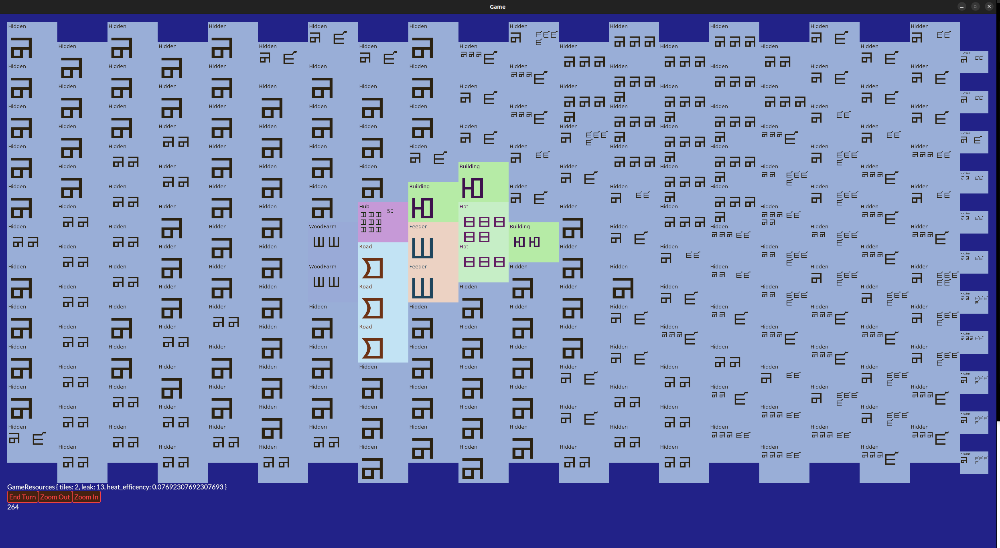

This repository for making a game in Rust. In part to learn rust, in part to learn how to make videogames.

If you have trouble building this project, it's probably caused by the UI framework we are using: https://iced.rs/ it depends on some libraries which aren't pulled automatically by cargo. 

Currently, this is barely a game, it's a bunch of systems that can later be used to make a proper fleshed out game. For example, like all numbers the games used a picked more or less at random. 

The core of the system is `src/celldata.rs`, it contains the two central datastructures:

 * `CellState` the state of a cell on the game board, this data is what most other systems operate on
 * `CellStateVariant` the different types of cells on the board, this defines what behaviour a cell should have. It is the only mandatory component of CellState

`src/hexgrid.rs` provides a hexagonal `i32 * i32` sized gird to operate on. It provides the main grid of `CellState`s that's rendered by the UI, but also supports the creation of other grids, which is handy if you need a datastructure which shares a cordinate system with the main board.

